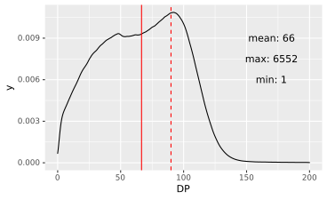
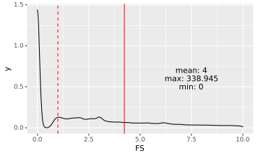
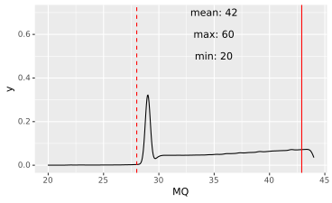
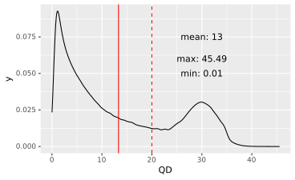
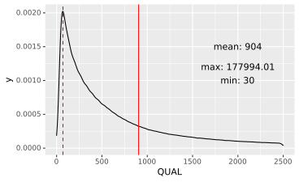
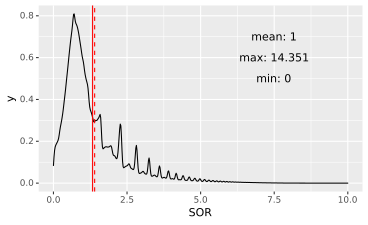
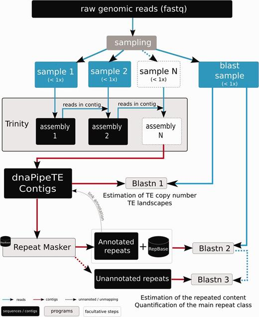
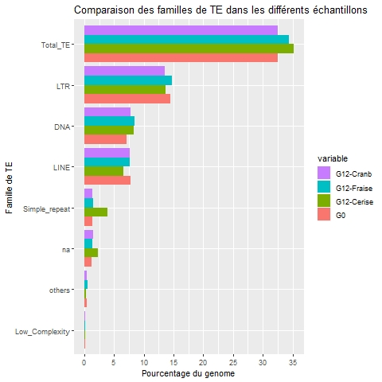

# Genomic and transcriptomic evolution of _D. suzukii_

## Table of contents

1. [Context](#1-context)
2. [Introduction to the project](#2-introduction-to-the-project)
3. [Data](#3-data)
4. [SNP Calling Workflow](#4-snp-calling-workflow)
5. [Diversity and Differentiation Analysis](#5-diversity-and-differentiation-analysis)
6. [TE Analysis](#6-te-analysis)
7. [Authors](#7-authors)
8. [References](#8-references)

## 1. Context

Since its recent invasion in the European and American continents, _Drosophila suzukii_, has become a major pest of berry crops. 
Contrary to other _Drosophila_ species that develop themselves on damaged or rotten fruit, _D. suzukii_ is able to lay its eggs in healthy fruit before harvest, using its __sclerotinized ovipositor__. In order to control the _D. suzukii_ population it is therefore required to improve our knowledge about its ability to adapt to a local environment outside its origin areas.

A previous study focused on phenotipic changes during a selective experiment showed a temporal adaptation of _D. suzukii_ populations in the three different fruit environments. This process produces a __fitness__ improvement which corresponds to a greater ability to reproduce and could explain the adaptation abilities  of _D. suzukii_. Based on the same experiment, a second study has been started by the LBBE to see if the _D. suzukii_ genome and transcriptome are affected by the environment.
 
The project is focused on both genes and Transposable Elements (TE) expression in order to find the variants explaining the local environment adaptation of _D. suzukii_. 
A significant number of differentially expressed genes across generations has been found with __RNAseq analysis__ between the G0 and the G7 generations. These variations seems to be independant of the fruit media. Moreover, in differentially expressed (DE) genes an increase of the number of Single Nucleotide Polymorphism (SNP) was found in G7 compared to G0, but this result was not expected. Natural selection generally keeps alleles which allow the best adaptation, and it is synonymous with a decrease in SNP number. 


## 2. Introduction to the project

### 2.1 Polymorphism analysis
The goal here is to analyse _D. suzukii_ polymorphism performing a __variant calling__ on the whole genome (using poolseq data) in order to count the number of different genomic positions between G0 and G12, and between fruits media. <br/>
The position of the genetic variations will be compared with previous SNP analysis conducted on RNA-seq data to see if we also find an increase of the SNP number. To have a view more global on the genome's diversity, several diversity measures will be calculated: __pi's__ $\theta$, __Watterson's__ $\theta$, __Tajima's D__.

### 2.2 TE analysis
__Transposable elements__ (__TE__) represent __47%__ of the _D. suzukii_ genome and can be important in the adaptation process, interfering in gene regulation during evolution. The aim is to determine TEs age on our data and compute their abundance. Comparing abundance graphs between G0 and G12 will inform us if some recent TE insertions happened.

All the project objectives are presented more precisely in the book of specifications file. 

## 3. Data

- DNA poolseq fastq from _D.suzukii_ obtained with paired-end Illumina sequencing (2x100pb), with 40 individuals for each pool:
    - One poolseq for G0;
    - One poolseq for each media in G12 (strawberry, cherry and cranberry).

<div align="center">

| File name    | Number of reads |
| :----------: | :-------------: |
| G0-MTP       | 242 990 252     |
| G12-cerise   | 214 319 262     |
| G12-cranb    | 261 528 888     |
| G12-fraise   | 216 028 586     |

</div>

Location: _pedago-ngs_ 
```
/localdata/pandata/students/M2_projet_15/data
```

- Partial assembly of _D. suzukii_ genome as reference (4 chromosomes, 542 contigs);

Location: _pedago-ngs_ 
```
/localdata/pandata/students/M2_projet_15/ref/Drosophila-suzukii-contig.fasta
```

- Annotation file at the format `gff3`.
Location: _pedago-ngs_ 
```
/localdata/pandata/students/M2_projet_15/ref/Drosophila-suzukii-annotation-3-ws.gff3
```

## 4. SNP Calling Workflow


### 4.1 Quality control

First of all we checked the quality of the data, using `fastqc` _(version v0.11.9)_:
```
fastqc sample.fastq.gz
```

Location: _pedago-ngs_ 
```
/localdata/pandata/students/M2_projet_15/quality_control
```

Then, we merged results from `fastqc` using `multiqc` in the folder with `fastqc` reports. The `html` report is available in the `quality_control` folder. <br>
We noticed a high __GC__ rate in the reads, but it seems to be in accordance with the results obtained by other researchs on _D. suzukii_.

### 4.2 Mapping

1. Genome indexing:
```
bwa index \
    -p Drosophila-suzukii-contig.fasta.fai \
    -a bwtsw Drosophila-suzukii-contig.fasta
```

- `-p`: index name;
- `-a`: index algorithm (_bwtsw_ for long genome).

2. Mapping samples on the reference:
```
bwa aln -t 14 Drosophila-suzukii-contig.fasta.fai sample_1.fastq.gz > sample_1.sai
bwa aln -t 14 Drosophila-suzukii-contig.fasta.fai sample_2.fastq.gz > sample_2.sai
```
- `-t`: number of threads.

3. Merge the `.sai` files of forward and reverse reads:
```
bwa sampe Drosophila-suzukii-contig.fasta.fai \
    sample_1.sai sample_2.sai \
    sample_1.fastq.gz sample_2.fastq.gz > sample_pe.sam
```
- `sampe`: take in account to have paired ends reads.

#### Mapping stats

Computation of mapped files statistics using:
```
samtools stats sample.sam
```

| sample | raw sequences | mapped and paired squences |
| :------: | :-------------: | :--------------------------: |
| G0-MTP_pe | 242495252 | 194326801 |
| G12-fraise_pe | 216028586 | 172898366 |
| G12-cerise_pe | 214319262 | 172440052 |
| G12-cranb_pe | 261528888 | 212135984 |

	
#### Conversion to `.bam`
```
samtools view -bS -@ 3 sample.sam > sample.bam
```
- `-bS`: output in the __BAM__ format ignoring for compatibility with previous samtools version;
- `-@`: number of threads.

Location: _pedago-ngs_ 
```
/localdata/pandata/students/M2_projet_15/mapping_bwa
```

__NB:__ Before using `bwa`, we tried to use `hisat2` but, for an unkown reason it could not map the strawberry sample.


### 4.3 Variant Calling
The SNP calling on pooled data is still not largely used because it is very innovative. For this reason it has required several tests (with different tools) and a long time to be completed. <br>
Finally, we used `GATK` to perform our SNP calling and for that we were inspired by M. Tabourin's workflow ([Analyse experience d'évolution expérimentale _D.suzukii_](https://github.com/mtabourin/Analyse-experience-d-evolution-experimentale-D.suzukii)) and from [this](https://yeamanlab.weebly.com/uploads/5/7/9/5/57959825/snp_calling_pipeline.pdf) document.

1. Sorting `.bam` files:

```
# GATK version: gatk-4.2.2.0
gatk SortSam -I sample.bam -O sample_sorted.bam -SO queryname -VALIDATION_STRINGENCY SILENT
```
    
- `-I`: input file;
- `-O`: output file;
- `-SO`: sort order of output file;
- `-VALIDATION_STRINGENCY`: Validation stringency for all SAM files read by this program. Setting stringency to `SILENT` can improve performance when processing a BAM file in which variable-length data (read, qualities, tags) do not otherwise need to be decoded.

2. Add read group info:
```
gatk AddOrReplaceReadGroups \
    -I sample_sorted.bam \
    -O sample_ReadGroups.bam \
    -RGID name \
    -RGLB name \
    -RGPL ILLUMINA \
    -RGPU name \
    -RGSM sample \
    -VALIDATION_STRINGENCY SILENT
```

- `-I`: input file;
- `-O`: output file;
- `-RGID`: Read-Group ID;
- `-RGLB`: Read-Group library;
- `-RGPL`: Read-Group platform;
- `-RGPU`: Read-Group platform unit(barcode);
- `-RGSM`: Read-Group sample name;
- `-VALIDATION_STRINGENCY`: Validation stringency for all SAM files read by this program.

__NB:__ Read group information flags (`-RG*`) are mandatory, even if you don't have them.

3. Remove duplicates:
```
gatk MarkDuplicatesSpark \
    -I sample_ReadGroups.bam \
    -O sample_MarkDuplicated.bam \
    --spark-master local[16]
```
- `-I`: input file;
- `-O`: output file;
- `--spark-master`: to parallelize the work.

4. Detect variant sites in the dataset:
```
gatk HaplotypeCaller \
    -R reference.fasta \
    -I sample_MarkDuplicated.bam \
    --sample-ploidy 80 -O sample.vcf \
    --max-genotype-count 91881
```
- `-R`: genome reference;
- `-I`: input file;
- `-O`: output file (`vcf` format);
- `--sample-ploidy`: it allows to take in account of using pooled data:
$sample\_ploidy = organism\_ploidy \times pool\_size$ <br>
In our case we have a ploidy of 2 (_D. suzukii_ is a diploïd organism) and a pool size of 40.
- `--max-genotype-count`: maximum number of genotypes to consider at any site:
$max\_genotype\_count = \binom{P +  A - 1}{A - 1} = \frac{(P + A - 1)!}{P!(A - 1)!}$ <br>
With `P` la ploidy of the sample (previous formula) and `A` ($A = 3$) the allele count. 

#### 4.3.1 SNPs filtering

1. Crete a subset keeping only __SNPs__:
```
gatk SelectVariants \
    -R reference_genome.fasta \
    -V input.vcf \
    -O output.vcf \
    --select-type-to-include SNP
```
- `-R`: genome reference;
- `-V`: `.vcf` input file;
- `-O`: output file;
- `--select-type-to-include` select a type of variant.

2. Generate a table that can be used to find filter thresholds:
```
	gatk VariantsToTable \
		-R reference_genome.fasta \
		-V input.vcf \
		-O output.table \
		# scores to save to the table
		-F CHROM \
		-F POS \
		-F QUAL \
		-F AC \
		-F AF \
		-F DP \
		-F QD \
		-F MQ \
		-F FS \
		-F SOR \
		-F MQRankSum \
		-F ReadPosRankSum
```
- `-R`: reference;
- `-V`: `.vcf` input file;
- `-O`: output file;
- `-F`: selected field.

The best way to choose the right filter, is to plot the several scores across the VCF file, for example using `ggplot2` library in `R`.
You can find here the plot used to define some scores: <br/>








<br/>

3. Use filter on `vcf` files:
```
	gatk VariantFiltration \
		-R reference_genome.fasta \
		-V input.vcf \
		-O output.vcf \
		# following results observed in plots
		-filter "QUAL < 70" --filter-name Low_Qual\
		-filter "DP < 90" --filter-name Low_Cov \
		-filter "QD < 20.0 || MQ < 28.0 || FS > 1.0 || \
		SOR > 1.4 --filter-name Secondary_filter
```
- `-R`: reference;
- `-V`: `vcf` input file;
- `-O`: output file;
- `-filter`: define a filter;
- `--filter-name`: used to assign a name to the filter.

4. Extract __SNPs__ who passed the filters:
```
gatk SelectVariants \
		-R reference_genome.fasta \
		-V input.vcf \
		-O output.vcf \
		--exclude-filtered
```
- `-R`: reference;
- `-V`: `vcf` input file;
- `-O`: output file;
- `--exclude-filtered`: exclude __SNPs__ marked to be filtered.

#### 4.3.2 Get __SNPs__ that are in transcripts (exons)

1. From the `.gff3` file of the reference, we can extract a subset having only exons:
```
tail -n +2 Drosophila-suzukii-annotation-3-ws.gff3 | \
awk -F "\t" '{if($3=="exon") print $0}' > ~/exon.gff3
```
- `tail -n +2`: to skip `gff3` header;
- `awk`: if the third field has 'exon' tag, it print the line in the `exon.gff3` file.

2. Convert the `.gff3` into `.bed` format:
```
gff2bed < exon.gff3 > exon.bed
```

3. Intersect the `.vcf` file with the `.bed` file:
```
intersectBed -a input.vcf -b exon.bed -header > output.vcf
```
- `-a`: `.vcf` input file;
- `-b`: `.bed` input file;
- `-header`: if the `.bed` file has header.

#### 4.3.3  Get __SNPs__ that are in DE genes

The list of differentially expressed genes is obtained by the M. Tabourin's work. From tables in her report, we retrieved the list of genes upregulated in cherry compared to G0 (`UP_cerise_G0.csv`), genes downregulated in cherry compared to G0 (`DOWN_cerise_G0.csv`), genes upregulated in strawberry compared to G0 (`UP_fraise_G0.csv`) and genes downregulated in strawberry compared to G0 (`DOWN_fraise_G0.csv`).
These files can be founded here: _pedago-ngs_ 
```
/localdata/pandata/students/M2_projet_15/DE_gene/csv
```

1. From theses files we have concatenated the two `cerise_G0` together and the same for the strawberry:

```
cat *cerise_G0.csv >> concat_cerise_G0.csv
cat *fraise_G0.csv >> concat_fraise_G0.csv
```

Then, we have retrieved the names of the genes contained in the first column:

```
cut -f1 -d" " concat_cerise_G0.csv > cerise_G0.txt
cut -f1 -d" " concat_fraise_G0.csv > fraise_G0.txt
```

At the end, we have concatenated theses two files:

```
grep -Ffx cerise_G0.txt fraise_G0.txt > fruit_G0.txt
```

2. Obtain a `.gff3` file containing only DE genes:
```
python3 get_de.py
```
- `get_de.py`: it is a script written by us (can be founded in the `scripts/` folder). It allows, from the `gff3` and the `list.txt` having DE genes, to obtain a `.gff3` file having only DE genes.

3. Then we have transformed the obtained `.gff3` file into `.bed` file using the command `3` at the previous paragraph and we have used it as in the command `4` of the previous paragraph to obtain __SNPs__ in DE genes for the DNA data. <br/>

4. For the RNAseq data we had to perform some additionnal steps, because we only had raw `vcf` files from the `GATK - HaplotypeCaller`.
Location of these `vcf` files: _pedago-ngs_

```
/data/home/mtabourin/Stage_M1
```

	- for each file, we had to compress and index:
	
	```
	bgzip -c file.vcf > file.vcf.gz
	tabix -p vcf file.vcf.gz
	```
	
		- `-c`: write to standard output;
		- `-p`: index q `vcf`file.
	
	- we have merged replicates in a single file (in the RNAseq experience, each sample had 2 evolutionary replicates):
	
	```
	bcftools merge --merge all rep1_file.vcf.gz rep1_file.vcf.gz > merged.vcf
	```
	
		- `--merge`: to merge all type of variants.
		
	- we have performed a genotype calling on theses files:
	
	```
	gatk GenotypeGVCFs -R Drosophila-suzukii.fasta -V file.vcf -O output.vcf
	```
	
To find __SNPs__ in `vcf` files from RNAseq we have used the `intersect_vcf_degene.sh` script (in the folder `/scripts` of this repo) running the following command:

```
./intersect_vcf_degene.sh input.vcf output.vcf
``` 

#### 4.3.4 Results

Location of `.vcf` result files: _pedago-ngs_
```
# DNA
/localdata/pandata/students/M2_projet_15/GATK_pipeline/gatk_ploidy 
# RNA
/localdata/pandata/students/M2_projet_15/RNAseq/vcf 
```
##### 4.3.4.1 SNPs founded on exons
|  | G0 | cerise | fraise |
| :-: | :-: | :-:| :-: |
|DNA | 59,055 | 50,077 | 52,243 |
| RNA | 28,150 | 29,823 | 31,052 |

##### 4.3.4.1 SNPs founded on exons of DE genes
|  | G0 | cerise | fraise |
| :-: | :-: | :-:| :-: |
|DNA | 536 | 415 | 492 |
| RNA | 17 | 36 | 51 |


### 4.4 Comparison of our results from DNA data with RNA seq data

1. Compress VCF files: ```bgzip input_DNA_file.vcf``` and ```bgzip input_RNA_file.vcf```
2. Build indexes for compressed files: ```tabix -p vcf input_DNA_file.vcf.gz``` and ```tabix -p vcf input_RNA_file.vcf.gz```
3. Run bcftools isec to make the intersection between the files of interest: ```bcftools isec -c snps -p fraise/ input_DNA_file.vcf.gz input_RNA_file.vcf.gz path2repository```

#### Results

Location of 4 output result files: _pedago-ngs_
```
/localdata/pandata/students/M2_projet_15/GATK_pipeline/gatk_ploidy/$fruit
```
- First file: 0000.vcf for records private to  fraise/G12_fraise_MarkDuplicated.bam.vcf.gz
- Second file: 0001.vcf for records private to  variants_RNAseq.vcf.gz
- Third file: 0002.vcf for records from fraise/G12_fraise_MarkDuplicated.bam.vcf.gz shared by both     fraise/G12_fraise_MarkDuplicated.bam.vcf.gz variants_RNAseq.vcf
- Fourth file: 0003.vcf for records from variants_RNAseq.vcf.gz shared by both  fraise/G12_fraise_MarkDuplicated.bam.vcf.gz variants_RNAseq.vcf.gz

## 5. Diversity and Differentiation Analysis

#### 5.0.1 Installating PoPoolation

All the steps come from PoPoolation website (https://sourceforge.net/p/popoolation/wiki/browse_pages/) and Dr. Kofler presentation (https://www.kofler.or.at/bioinformatic/wp-content/uploads/2018/07/pooledAnalysis_part1.pdf)

```
svn checkout https://svn.code.sf.net/p/popoolation/code/trunk popoolation-code
cd popoolation-code
svn update
```

### 5.1 Diversity Analysis workflow

1. Remove low quality alignments:

```
time samtools view -q 20 -f 0x0002 -F 0x0004 -F 0x0008 -b G0_MarkDuplicated.bam > G0_q20_MarkDuplicated.bam
```

- `-q 20` only keep reads with a mapping quality higher than 20 (remove ambiguously aligned reads)
- `-f 0x0002` only keep proper pairs (remember flags from sam file)
- `-F 0x0004` remove reads that are not mapped
- `-F 0x0008` remove reads with an un-mapped mate

Note `-f` means only keep reads having the given flag and `-F` discard all reads having the given flag.	

2. Creating a mpileup file:

```
time samtools mpileup -B -Q 0 -f Drosophila-suzukii-contig.fasta G0_q20_MarkDuplicated.bam > G0.mpileup
```

- `-B` disable BAQ computation (base alignment quality)
- `-Q` skip bases with base quality smaller than the given value
- `-f` path to reference sequence

`.mpileup` files:
- column 1: reference chromosome;
- column 2: position;
- column 3: reference character;
- column 4: coverage;
- column 5: bases for the given position (`.` identical to reference character in forward strand; 	`,` identical to reference in reverse strand);
- column 6: quality for the bases.

3. Filtering indels:

```
time perl identify-genomic-indel-regions.pl --indel-window 5 --min-count 2 --input G0.mpileup --output indels_G0.gtf
```

- `identify-genomic-indel-regions.pl`: script from `Popoolation`;
- `--indel-window` how many bases surrounding indels should be ignored;
- `--min-count` minimum count for calling an indel. Note that indels may be sequencing errors as well.

```
time perl filter-pileup-by-gtf.pl --input G0.mpileup --gtf indels_G0.gtf --output G0.idf.mpileup
```
4. Subsampling to uniform coverage
Several population genetic estimators are sensitive to sequencing errors. For example a very low __Tajima’s D__, usually indicative of a selective sweep, may be, as an artifact, frequently be found in highly covered regions because these regions have just more sequencing errors. To avoid these kinds of biases we recommend to subsample to an uniform coverage:

```
time perl subsample-pileup.pl --min-qual 20 --method withoutreplace --max-coverage 50 --fastq-type sanger --target-coverage 10 --input G0.idf.mpileup --output G0.ss10.idf.mpileup
```

- `subsample-pileup.pl`: script from `Popoolation;
- `--min-qual` minimum base quality;
- `--method` method for subsampling, we recommend without replacement;
- `--target-coverage` which coverage should the resulting mpileup file have;
- `--max-coverage` the maximum allowed coverage, regions having higher coverages will be ignored (they may be copy number variations and lead to wrong SNPs);
- `--fastq-type` (sanger means offset 33).

5. Calculating __Tajima’s__ $\pi$:

```
time perl Variance-sliding.pl --fastq-type sanger --measure pi --input G0.ss10.idf.mpileup --min-count 2 --min-coverage 4 --max-coverage 10 --min-covered-fraction 0.5 --pool-size 80 --window-size 1000 --step-size 1000 --output G0.pi --snp-output G0.snps
```

- `--min-coverage`, `--max-coverage`: for subsampled files not important; should contain target
coverage (i.e.: 10);
- `--min-covered-fraction` minimum percentage of sites having sufficient coverage in the given window;
- `--min-count minimum` occurrence of allele for calling a SNP;
- `--measure` which population genetics measure should be computed ($\pi$ / $\theta$ / $D$);
- `--pool-size` number of chromosomes (thus number of diploids times two);
- `--region` compute the measure only for a small region, default is the whole genome;
- `--output` a file containing the measure ($\pi$) for the windows;
- `--snp-output` a file containing for every window the SNPs that have been used for computing the measure (e.g. $\pi$);
- `--window-size`, `--step-size` control behavior of sliding window. If step size is smaller than window size than the windows will be overlapping.

Output `G0.pi` explanation:
- column 1: reference chromosome;
- column 2: position of window (mean value);
- column 3: number of SNPs in the given window;
- column 4: fraction of sites in the window having, sufficient coverage (min ≤ x ≤ max);
- column 5: measure for the window ($\pi$).

Output `G0.snps` explanation:
- column 1: reference chromosome;
- column 2: position of SNP;
- column 3: reference character;
- column 4: coverage;
- columns 5-9: counts of A, T, C, G, N respectively.

#### 5.0.2 Installating PoPoolation2

All the steps comes from PoPoolation website (https://sourceforge.net/p/popoolation2/wiki/Home/) and Dr. Kofler presentation (https://www.kofler.or.at/bioinformatic/wp-content/uploads/2018/07/pooledAnalysis_part2.pdf)

```
svn checkout https://svn.code.sf.net/p/popoolation2/code/trunk popoolation2-code
cd popoolation2-code/
svn update
```

### 5.2 Differentiation Analysis

1. Create a `mpileup`:

```
time samtools mpileup -B -Q 0 -f Drosophila-suzukii-contig.fasta G0_q20_MarkDuplicated.bam G12_cerise_q20_MarkDuplicated.bam G12_cran_q20_MarkDuplicated.bam G12_fraise_q20_MarkDuplicated.bam > p1-4.mpileup # 77m
```

__MPILEUP__: Very similar to the mpileup with one sample. In this multi-pileup (mpileup) three additional columns are created for each additional sample. Thus for each sample the following information is provided:
- the coverage, columns $4 + n ∗ 3$;
- the bases, columns $5 + n ∗ 3$;
- the corresponding base quality, columns $6 + n ∗ 3$;

2. Conversion to sync-file:

In order to use PoPoolation2 we have to convert the `mpileup` to a sync file.
This may seem unnecessary to you, but it serves to speed up the analysis, because the time consuming part of the analysis - parsing of the `mpileup` file - needs just to be performed once.

```
time java -jar mpileup2sync.jar --input p1-4.mpileup --output p1-4.sync --fastq-type sanger --min-qual 20 --threads 15 
```

The `sync` file:

- column 1: reference chromosome;
- column 2: position;
- column 3: reference character;
- column 4: allele counts for first population;
- column 5: allele counts for second population;
- column n: allele counts for n-3 population.

Allele counts are in the form `A:T:C:G:N:del`. The sync-file provides a convenient summary of the allele counts of several populations (there is no upper threshold of the population number). Subsampling to an uniform coverage with the `PoPoolation2` pipeline should be done using such a sync-file.

3. Calculating the $F_{st}$:
```
time perl fst-sliding.pl --window-size 1 --step-size 1 --suppress-noninformative --input small.sync --min-covered-fraction 1.0 --min-coverage 4 --max-coverage 120 --min-count 3 --output fst.txt --pool-size 80
```
- `--suppress-noninformative` suppresses output for windows not containing a SNP. When applied to windows of size one, this option suppresses output for bases that are no SNP. 

Output of the $F_{st}$ script:

- column 1: reference chromosome;
- column 2: position;
- column 3: window size (1 for single SNPs);
- column 4: covered fraction (relevant for minimum covered fraction);
- column 5: average minimum coverage for the window across all populations (the higher the more reliable the estimate);
- column 6: pairwise F ST comparing population 1 with population 2;
- column 7: etc for ALL pairwise comparisons of the populations present in the sync file.

## 6. TE Analysis
All the steps are included in a tool named [dnaPipeTE](https://github.com/clemgoub/dnaPipeTE)
- Uniform samplings of the reads to produce low coverage data sets (read sampling to have <1X coverage of the genome to keep only repeated regions)
- Trinity, repeated assembly of contigs
- RepeatMasker, contigs annotation
- Blastn, repeat quantification



Figure from the [tool article](https://academic.oup.com/gbe/article/7/4/1192/533768)

### 6.1 Running DnaPipeTE
```
#dnaPipeTE: version 1.3 (uses Perl 5, R v3.0.2, Python v3.8.5, Trinity v2.5.1, 
			      RepeatMasker v4.0.5 including RMblastn, ncbi-blast v2.2.28+)
```
We had a lot of dependancies problems running dnaPipeTE so we used the [docker version](https://hub.docker.com/r/clemgoub/dnapipete).

1. Copy input data

Two different types of input are necessary to run the pipeline : 
- The fastq files for each samples
- `Drosophila_Transposable_Element_all.fasta` which is the Drosophila TE library from Repbase  

Location :  _pedago-ngs_
```
/localdata/pandata/students/M2_projet_15/TE/
```

They all had to be in a `~/Project` folder which is the communication folder between the computer and the container. 

2. Starting the container 
```
sudo docker pull clemgoub/dnapipete:latest
sudo docker run -it -v ~/Project:/mnt clemgoub/dnapipete:latest
```

3. Run dnaPipeTE
```
cd /opt/dnaPipeTE
python3 dnaPipeTE.py \ 
		-input /mnt/data/sample_1.fastq.gz 
		-output /mnt/output_dnapipete/sample 
		-cpu 6 
		-genome_size 270000000 
		-genome_coverage 0.2 
		-sample_number 2 
		-RM_lib /mnt/Drosophila_Transposable_Element_all.fasta
```
- `-input`: input fastq or fastq.gz files (single end only);
- `-output`: complete path with name for the outputs;
- `-cpu`: maximum number of cpu to use;
- `-genome_size`: here we know that _D.suzukii_ is 270Mb long;
- `-genome_coverage`: for this genome size 0.2X is recommended in the Supplementary Material of the [tool article](https://academic.oup.com/gbe/article/7/4/1192/533768);
- `-sample_number`: number of Trinity iterations (2 is the minimum and recommended number of iterations);
- `-RM_lib`: path to custom repeat library for RepeatMasker.

### 6.2 Results

Example of sampling for G0 :
```
total number of reads: 121247626
maximum number of reads to sample:  710526
fastq :  /mnt/G0-MTP_1.fastq
sampling 2 samples of max 355263 reads to reach coverage...
53999976 bases sampled in 355263 reads
s_G0-MTP_1.fastq done.
53999976 bases sampled in 710526 reads
s_G0-MTP_1.fastq done.
```
The pipeline gives several useful outputs such as the **Landscapes** (TE divergence to estimate the insertions) and **PieChart** (TE families proportions in the genome).
Other graphs have been created with the script `graphs.R` to compare TE throught different sample generations. 



Other graphs can be found in the `graphs.pdf` document.


## 7. Authors
The project was developped by:
- Chloé AUJOULAT
- Tommaso BARBERIS
- Bertrand HUGUENIN-BIZOT
- Marie VERNERET


## 8. References
- Anand, Santosh, Eleonora Mangano, Nadia Barizzone, Roberta Bordoni, Melissa Sorosina, Ferdinando Clarelli, Lucia Corrado, Filippo Martinelli Boneschi, Sandra D’Alfonso, et Gianluca De Bellis. « Next Generation Sequencing of Pooled Samples: Guideline for Variants’ Filtering ». Scientific Reports 6, no 1 (27 septembre 2016): 33735. https://doi.org/10.1038/srep33735.
- Chiu, Joanna C, Xuanting Jiang, Li Zhao, Christopher A Hamm, Julie M Cridland, Perot Saelao, Kelly A Hamby, et al. « Genome of Drosophila suzukii, the Spotted Wing Drosophila ». G3 Genes|Genomes|Genetics 3, no 12 (1 décembre 2013): 2257‑71. https://doi.org/10.1534/g3.113.008185.
- Kofler, Robert, Daniel Gómez-Sánchez, et Christian Schlötterer. « PoPoolationTE2: Comparative Population Genomics of Transposable Elements Using Pool-Seq ». Molecular Biology and Evolution 33, no 10 (octobre 2016): 2759‑64. https://doi.org/10.1093/molbev/msw137.
- Olazcuaga, Laure, Julien Foucaud, Mathieu Gautier, Candice Deschamps, Anne Loiseau, Nicolas Leménager, Benoit Facon, et al. « Adaptation and Correlated Fitness Responses over Two Time Scales in Drosophila Suzukii Populations Evolving in Different Environments ». Journal of Evolutionary Biology 34, no 8 (2021): 1225‑40. https://doi.org/10.1111/jeb.13878.
- Clément Goubert, Laurent Modolo, Cristina Vieira, Claire ValienteMoro, Patrick Mavingui, Matthieu Boulesteix, De Novo Assembly and Annotation of the Asian Tiger Mosquito (Aedes albopictus) Repeatome with dnaPipeTE from Raw Genomic Reads and Comparative Analysis with the Yellow Fever Mosquito (Aedes aegypti), Genome Biology and Evolution, Volume 7, Issue 4, April 2015, Pages 1192–1205, https://doi.org/10.1093/gbe/evv050
- Marie  Tabourin  et  al.  “Analyse  de  l’expression  des  gènes  et  des  éléments  transposableschez Drosophila suzukii suite à une expérience d’évolution expérimentale.
- Simon Andrews et al.FastQC. Babraham Institute. Babraham, UK, Jan. 2012, https://www.bioinformatics.babraham.ac.uk/projects/fastqc/.
- MultiQC: Summarize analysis results for multiple tools and samples in a single report, Philip Ewels, Måns Magnusson, Sverker, Lundin and Max Käller, Bioinformatics (2016), doi: 10.1093/bioinformatics/btw354, PMID: 27312411.
- Li H. and Durbin R. (2009) Fast and accurate short read alignment with Burrows-Wheeler Transform. Bioinformatics, 25:1754-60. [PMID: 19451168].
- Heng Li, Bob Handsaker, Alec Wysoker, Tim Fennell, Jue Ruan, Nils Homer, Gabor Marth, Goncalo Abecasis, Richard Durbin, 1000 Genome Project Data Processing Subgroup, The Sequence Alignment/Map format and SAMtools, Bioinformatics, Volume 25, Issue 16, 15 August 2009, Pages 2078–2079, https://doi.org/10.1093/bioinformatics/btp352.
- Van der Auwera GA & O'Connor BD. (2020). Genomics in the Cloud: Using Docker, GATK, and WDL in Terra (1st Edition). O'Reilly Media.
- Wickham H (2016). ggplot2: Elegant Graphics for Data Analysis. Springer-Verlag New York. ISBN 978-3-319-24277-4, https://ggplot2.tidyverse.org.
- R Core Team (2021). R: A language and environment for statistical computing. R Foundation for Statistical Computing, Vienna, Austria. URL https://www.R-project.org/.
- Bedops.readthedocs.io. 2021. 6.3.3.5. gff2bed — BEDOPS v2.4.40. (online) Available at: https://bedops.readthedocs.io/en/latest/content/reference/file-management/conversion/gff2bed.html (Accessed 2 December 2021).
- Bedtools.readthedocs.io. 2021. intersect — bedtools 2.30.0 documentation. (online) Available at: https://bedtools.readthedocs.io/en/latest/content/tools/intersect.html (Accessed 2 December 2021).
