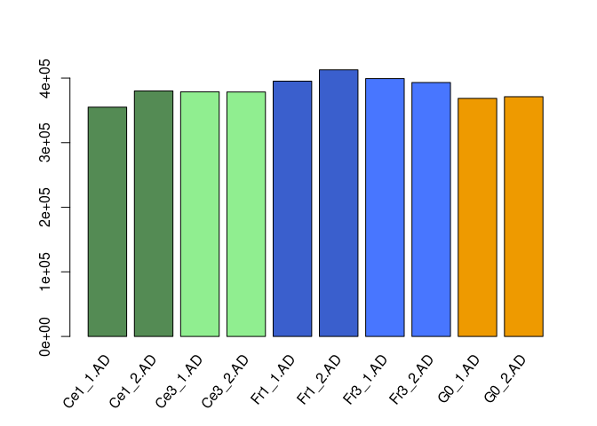

The *variants.table* file is obtained during a **variant calling**
experiment using *HaplotypeCaller* from *GATK*, by M. **Tabourin**. The
following code is inspired from her work too.

``` r
library(tidyverse)
```

    ## ── Attaching packages ─────────────────────────────────────── tidyverse 1.3.1 ──

    ## ✓ ggplot2 3.3.5     ✓ purrr   0.3.4
    ## ✓ tibble  3.1.5     ✓ dplyr   1.0.7
    ## ✓ tidyr   1.1.4     ✓ stringr 1.4.0
    ## ✓ readr   2.0.2     ✓ forcats 0.5.1

    ## ── Conflicts ────────────────────────────────────────── tidyverse_conflicts() ──
    ## x dplyr::filter() masks stats::filter()
    ## x dplyr::lag()    masks stats::lag()

``` r
data <- read.table("variants.table",header = T, sep = "\t")
```

# Variant calling

So, now we will try to compute the number of variant for every sample:

``` r
samples <- c("Ce1_1.AD", "Ce1_2.AD", "Ce3_1.AD", "Ce3_2.AD", "Fr1_1.AD", "Fr1_2.AD", "Fr3_1.AD", "Fr3_2.AD", "G0_1.AD", "G0_2.AD")
results <- list()

for (sample in samples) {

  SNP_number <- 0

  for (variant in data[[sample]]) {

    i = dim(str_split(variant, ",", simplify = TRUE))[2]
    pass = "False"

    while (pass == "False") {
      if ((str_split(variant, ",", simplify = TRUE)[i]) > 0){
        SNP_number = SNP_number + 1
        pass = "True"
      }

      i = i - 1

      if (i == 1) {
        pass = "True"
      }
    }
  }

  results$samples[[sample]] <- SNP_number
}
```

**Barplot** showing number of variants for every sample:

``` r
library(grid)
library(gridBase)

variant_barplot <- barplot(unlist(results), names.arg="", col=c("palegreen4","palegreen4","palegreen2", "palegreen2", "royalblue3", "royalblue3",
                "royalblue1", "royalblue1", "orange2", "orange2"))

## Use grid to add the labels    
vps <- baseViewports()
pushViewport(vps$inner, vps$figure, vps$plot)

grid.text(samples,
    x = unit(variant_barplot, "native"), y=unit(-1, "lines"),
    just="right", rot=50)

popViewport(3)
```


